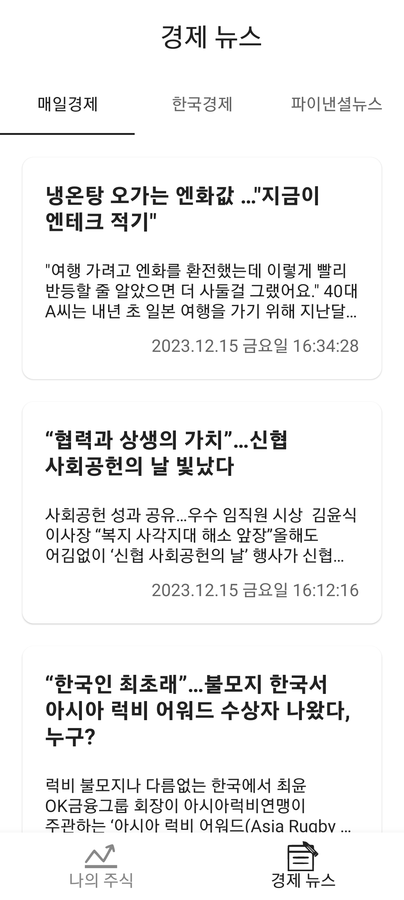

# Stockprotfolio
안드로이드 개발 기술 향상을위한 개인 사이드 프로젝트입니다.
### 1. Screenshot

    
    
    

### 2. App feature introduce
- 나의 주식
  - 내가 산 국내 주식의 가격을 입력하여 추가합니다.
  - 데이터 포털에서 제공하는 하루전날 주식 종가를 기준으로 현재 나의 수익을 확인할 수 있습니다.
- 경제 뉴스
  - 매일 경제, 한국 경제, 파이낸셜뉴스에서 제공하는 실시간 경제 뉴스를 볼 수 있습니다.

### 3. Changed android develop skill stacks
 - Kotlin
 - MVVM
 - Compose
 - Room, Retrofit2
 - Hilt
 - Flow
 - Coroutine
 - Kotlinx Serialization
